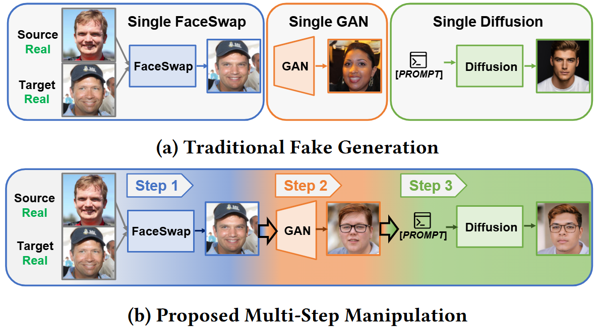

# FakeChain: Exposing Shallow Cues in Multi-Step Deepfake Detection

We are providing samples of **multi-step** manipulations under various settings.

## 🧩 Manipulation Depth & Composition

We organize the dataset by manipulation depth:

- `1Step/`: Single-generator manipulations
  - `FF/`   – FaceSwap (FaceFusion)
  - `SG3/`  – GAN-based (StyleGAN3)
  - `SS/`   – GAN-based (StyleSwin)
  - `SD3/`  – Diffusion-based (Stable Diffusion 3)
  - `SDXL/` – Diffusion-based (Stable Diffusion XL)

- `2Step/`: Two-step compositional manipulations  
  Each subfolder corresponds to an ordered pair of distinct generators, e.g.,
  `FF_SG3` (FaceFusion → StyleGAN3), `SG3_SD3` (StyleGAN3 → Stable Diffusion 3), etc.  
  Homogeneous pairs (same generator twice) are not used.

- `3Step/`: Three-step compositional manipulations  
  Homogeneous combinations are excluded to prioritize realistic and diverse compositional scenarios.  
  Each 3-step chain selects exactly one method from each family:
  - FaceSwap: `FF`
  - GAN: `SG3` or `SS`
  - Diffusion: `SD3` or `SDXL`

---

## 📥 Dataset Access

The FakeChain dataset is hosted on **Harvard Dataverse**.  
Due to identity and licensing considerations, the dataset is **restricted** and not publicly downloadable.

To request access, please visit the link below and click **“Request Access”** on the right side of the file list:

🔗 https://dataverse.harvard.edu/dataset.xhtml?persistentId=doi:10.7910/DVN/ATZAEJ

Once a request is submitted, I will manually review and grant access as soon as possible.

---

## 📌 Usage Policy

This dataset is provided **for research and educational purposes only**.  
Any form of **redistribution, commercial use, or public demonstration** is strictly prohibited.

License: **CC BY-NC 4.0**

---

## ⚠️ HuggingFace Release (In Progress)

A full mirrored version of FakeChain on **HuggingFace** is planned for improved accessibility.  
However, due to ongoing **storage and hosting constraints**, the upload is still in progress.

The repository will be updated as soon as the HuggingFace release becomes available.

---

## 📨 Contact

If you have questions regarding dataset access, feel free to contact:

📩 **minji.h0224@g.skku.edu**

 
